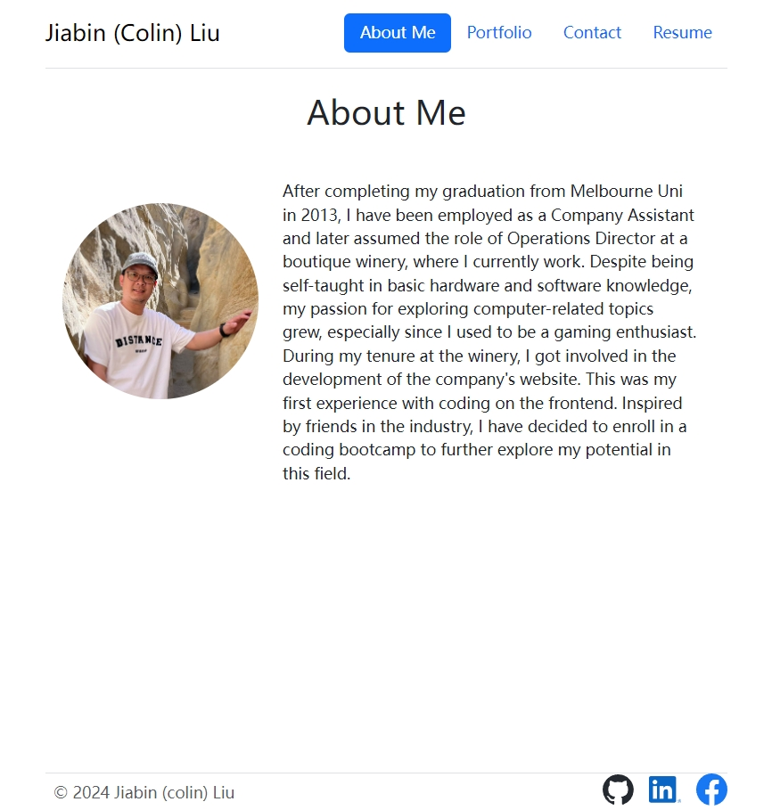
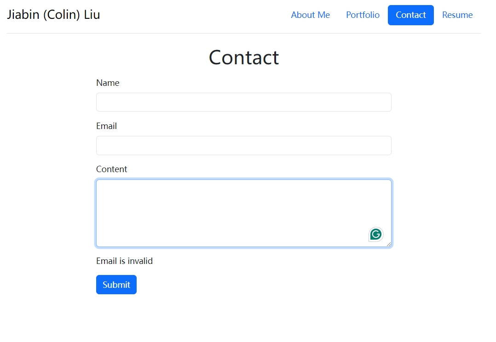
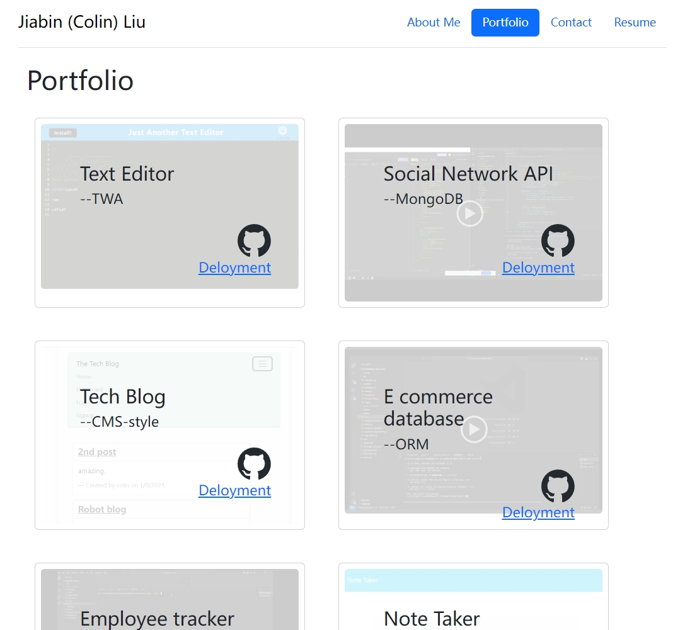
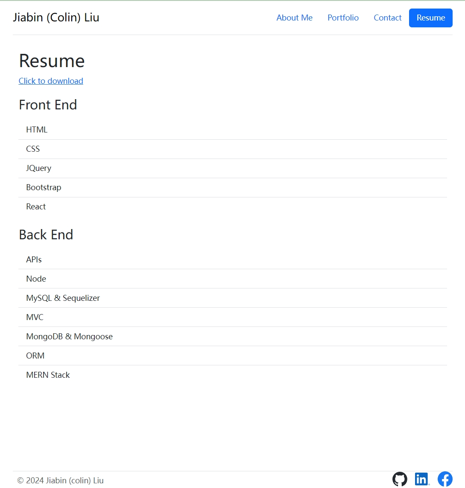

# Profile - React

## Description

A personal profile build with ReactJS

## Table of Contents

- [Installation](#installation)
- [Usage](#usage)
- [License](#license)
- [Contribution](#contribution)
- [Test](#test)
- [Further Questions](#furtherquestions)

## Installation

for local installtion:

Open the directory from VS Code.

1. go to the db directory

2. run $npm install to install packages.

3. run the app $npm run start.

4. use localhost:3000 as the URL to run the app.

for online user:
1. simply open this link to use:
https://65c503cab252ee36cbb91c95--calm-babka-22a32a.netlify.app/

## Usage

1. open the link and see the pages about Colin`s profile

  
  
  
  

## License

N/A

## Contribution
You can contribute to this application by revising the codes here:  
https://github.com/mkdkck/textEditor-PWA

## Test
N/A

## FurtherQuestions

please review the codes here：  
https://github.com/mkdkck/textEditor-PWA

or contact the owner via: colin173@gmail.com

## Badges

